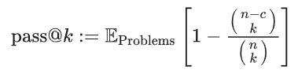
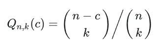
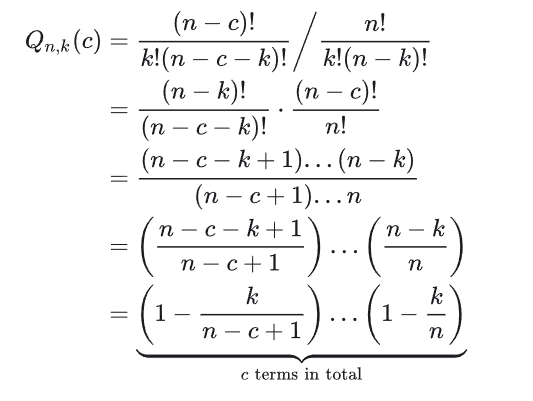

假设模型只能生成这 n 个代码，而且他们每一种被生成出来的概率是相等的，其中有 c 个可以通过测试。

那么模型任意生成 k 个代码，全都不能通过测试的概率是：**生成 k 个不能通过测试的代码的情况总和与生成 k 个代码的全部情况总和之比**

然后 1 减去这个值就是pass@k

```python
import itertools
from typing import List, Union
import numpy as np


# openai 源代码
def estimate_pass_at_k(
    num_samples: Union[int, List[int], np.ndarray],
    num_correct: Union[List[int], np.ndarray],
    k: int,
) -> np.ndarray:
    """
    Estimates pass@k of each problem and returns them in an array.
    """

    def estimator(n: int, c: int, k: int) -> float:
        """
        Calculates 1 - comb(n - c, k) / comb(n, k).
        """
        if n - c < k:
            return 1.0
        return 1.0 - np.prod(1.0 - k / np.arange(n - c + 1, n + 1))

    if isinstance(num_samples, int):
        # 使用 itertools.repeat 函数创建一个迭代器，将 num_samples 重复 len(num_correct) 次，确保列表长度是一致
        num_samples_it = itertools.repeat(num_samples, len(num_correct))
    else:
        assert len(num_samples) == len(num_correct)
        num_samples_it = iter(num_samples)

    return np.array(
        [estimator(int(n), int(c), k) for n, c in zip(num_samples_it, num_correct)]
    )
```

迭代器的主要用途是内存和效率的优化，它可以一次生成一个元素，而不是一次性生成所有元素。